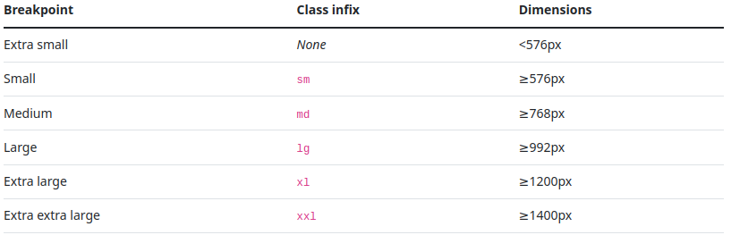
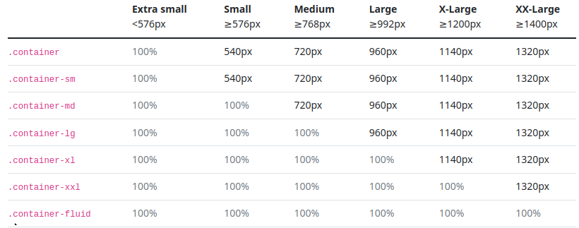

## Bootstrap
### ¿Qué es Bootstrap?

Es un framework de front-end, gratis, open source usado para la creación de sitios web y aplicaciones web. Diseñado para el desarrollo responsive de sitios web “mobile-first”	3
Como framework, Bootstrap incluye bases para el desarrollo web responsive, por lo que los desarrolladores solo necesitan insertar el código en un sistema de cuadrícula predefinido. El framework de Bootstrap está construido sobre HTML, CSS y JavaScript.

### Palabras a destacar

- **Mobile-first:** Este término se refiere al enfoque de diseño y desarrollo que prioriza la creación de un sitio web o aplicación para dispositivos móviles antes de adaptarlo a pantallas más grandes, asegurando una buena experiencia de usuario en pantallas más pequeñas.

- **Responsive:** Este término describe un diseño que puede ajustarse de manera dinámica para adaptarse a diferentes tamaños de pantalla y dispositivos.

- **Framework:** Este término se refiere a un conjunto preestablecido de herramientas, bibliotecas y convenciones para que los desarrolladores utilicen como base para construir aplicaciones o sitios web de manera más eficiente.


## Historia
Fue diseñado y creado en Twitter (ahora X) a mediados de 2010 por Mark Otto y Jacob Thornton. Se desarrolló como solución a un problema de inconsistencias entre dependencias dentro del equipo de Twitter, debido a que los desarrolladores utilizaban distintos acercamientos, las inconsistencias fueron inevitables. Lo cual a la larga aumentan el tiempo de mantenimiento. Luego de ser creado por Mark Otto y Jacob Thorton el equipo pudo trabajar más rápido, más eficientemente y con menos inconsistencias.
Comenzó siendo una herramienta interna, y pasó a ser open-source en Agosto de 2011.
- Bootstrap 2: Se agregó funcionalidades responsive al framework entero.
- Bootstrap 3: Se reescribió para que sea mobile first
- Bootstrap 4: Cambios arquitectura claves, se migro a Sass y a CSS’s flexbox
- Bootstrap 5: cambiaron de jQuery a JavaScript Vainilla.

## Razones para usar Bootstrap
Bootstrap es un framework CSS, que nos va a permitir crear páginas web adaptables a cualquier dispositivo.
Algunas de las razones por las que bootstrap es una herramienta muy útil, son las siguientes:

1. **Es de uso fácil.**
   Bootstrap es una herramienta muy intuitiva, que con solo conocimientos básicos de HTML, CSS y JavaScript, nos va a permitir acceder y modificar fácilmente.

2. **Es compatible con distintos navegadores:**
   Hoy en día los usuarios utilizan distintos navegadores, por lo que es importante tener en cuenta este punto al desarrollar una aplicación. Bootstrap se adapta perfectamente a los navegadores más utilizados hoy en día, como suele ser Chrome, Firefox, Microsoft Edge, Opera, etc.

3. **Diseño Responsive**
   Bootstrap contiene todas las reglas CSS, por los que nos permite que la página web se adapte a cualquier pantalla, olvidándonos del clásico media queries y porcentajes de css.

4. **Comunidad web.**
   Bootstrap es una herramienta consolidada, y muy conocida, por lo que vas a poder encontrar información fácilmente en la web y foros.


## Porque no usar Bootstrap

1. **Aspecto Genérico:** Dado que Bootstrap se utiliza ampliamente, los sitios web construidos únicamente con sus estilos y componentes predeterminados pueden tener una apariencia similar. Si buscas un diseño único y altamente personalizado, es posible que debas invertir un esfuerzo adicional en anular o modificar los estilos predeterminados de Bootstrap.

2. **Curva de Aprendizaje:** Aunque Bootstrap simplifica el desarrollo, aún existe una curva de aprendizaje para comprender su sistema de cuadrícula, componentes y opciones de personalización. Si ya estás familiarizado con los marcos de CSS o tienes requisitos de diseño específicos, adaptarte a las convenciones de Bootstrap puede llevar tiempo.

3. **Código No Utilizado**: Bootstrap es un marco grande, y si utilizas solo un subconjunto de sus características, tu sitio web puede incluir código CSS y JavaScript innecesario. Esto puede afectar el rendimiento y aumentar el tamaño del archivo, lo que podría afectar los tiempos de carga de la página.

4. **Requisitos Específicos del Proyecto:**
   Dependiendo de los requisitos únicos de tu proyecto, otros marcos o un enfoque personalizado pueden ser más adecuados para tus necesidades. Bootstrap puede no ser la elección óptima si tienes especificaciones de diseño estrictas, funcionalidades altamente especializadas o si prefieres una solución más liviana.


## ¿Como instalar Bootstrap?

Existen 3 maneras de instalar bootstrap en nuestro proyecto.

1. **Descargando los archivos por la web:**
   Ingresando a www.getbootstrap.com, podremos descargar todos los archivos necesarios para que bootstrap funcione en nuestro proyecto
   Una vez descargado, tendremos un zip con todos los archivos del framework: una carpeta «css» y otra «js».
   Para que funcione bootstrap, hay que agregar los archivos en la carpeta de nuestro proyecto y luego añadir el siguiente codigo en la cabecera, dentro de la etiqueta "head" o antes de la etiqueta de cierre "body" del archivo HTML las hojas de estilo y el archivo JavaScript de Bootstrap

**En la seccion head:**\
``` <link href="node_modules/bootstrap/dist/css/bootstrap.min.css" rel="stylesheet" >```

**En la seccion body:**\
```<script src="node_modules/bootstrap/dist/js/bootstrap.bundle.min.js"></script>```

2. Otra manera, es agregando el link a nuestro codigo HTML.
   El link lo podemos conseguir también de la página de bootstrap.
   El punto negativo de utilizar este metodo, es que si no tenemos internet, bootstrap no va a funcionar.

El codigo que tenemos que ingresar en nuestro codigo HTML es el siguiente:

``` <link href="https://cdn.jsdelivr.net/npm/bootstrap@5.3.2/dist/css/bootstrap.min.css" rel="stylesheet" integrity="sha384-T3c6CoIi6uLrA9TneNEoa7RxnatzjcDSCmG1MXxSR1GAsXEV/Dwwykc2MPK8M2HN" crossorigin="anonymous">```

``` <script src="https://cdn.jsdelivr.net/npm/bootstrap@5.3.2/dist/js/bootstrap.bundle.min.js" integrity="sha384-C6RzsynM9kWDrMNeT87bh95OGNyZPhcTNXj1NW7RuBCsyN/o0jlpcV8Qyq46cDfL" crossorigin="anonymous" ></script>```


## Componentes de layout fundamentales
- Sistema de grilla
- Breakpoints
- Containers
- Filas y Columnas (Grid Layout)

Bootstrap utiliza una serie de contenedores (containers), filas y columnas para ubicar y alinear el contenido.

### Breakpoints
Definen los anchos en el que puede cambiar el tamaño de la ventana o dispositivo, y por lo tanto ajustar el contenido de la pagina. Bootstrap ya viene con estos valores predefinidos, pero pueden ser modificables en el archivo scss/_variables.scss.<br>
Nos ayuda a definir como va a responder nuestra pagina a distitnos tamaños de ventana.
<br>
Los breakpoints definidos por defecto son:



Extra Small (xs): Se usa generalmente para la pantalla de telefonos en modo vertical.<br>
Small (sm): Para pantallas que son un poco mas anchas que las de telefonos, como tabletas, o telefonos en modo horizontal.<br>
Medium (md): Pantallas de tamaño mediano, como puede ser notebook o monitores chicos<br>
Large (lg): Generalmente se usan para pantallas de escritorio comunes. <br>

### Containers

Es la funcionalidad más básica de Bootstrap. Es la que contiene, rellena y alinea el contenido, ayudando a mantener un layout o distribucion consistente y legible, en distitntos tamaños de pantalla <br>
Hay tres tipos de contenedores principales:<br>
- <b>Container</b>:
  Es un contenedor que se mantiene centrado a la pagina.
  Se adapta al tamaño de la ventana, es decir a partir de cada breakpoint, ajusta su tamaño.
- <b>Container-fluid</b>:
  Es un contenedor que ocupa siempre el 100% de la ventana,
  Es util para crear header, footers, navbar, es decir todo contenido que necesita usar todo el ancho de la ventana
- <b>Container-{breakpoint}</b>:
  Este contenedor ocupa el 100% de la ventana, hasta que se alcance el breakpoint definido, luego tiene el mismo comportamiento que un container comun.
  <br>



### Grid System
Como ya dijimos, Bootstrap utiliza un sistema grilla que se entiende como un sistema de filas (.row) y columnas (.col), en total tiene 12 columnas, que nos va a ayudar a organizar el contenido y estructurar la página.

- Filas (.row): Basicamente contienen a las columnas
- Columnas (.col): Es donde colocamos el contenido.
  Especifiando la cantidad de columnas que queremos que ocupe un elemento, podemos ocupar una parte o la totalidad de la fila. Las  columnas del sistema se adaptan automaticamente al tamaño de la ventana o del contenedor.

Para definir una columna podemos usar la clase:
- .row
- .col
- .col-sm-*
- .col-md-*
- .col-lg-*
- .col-xl-*
- .col-xxl-*
- .col-{breakpoint}-auto

Con class="row" estamos diciendo que ese elemento html se va a convertir en una fila.
Haciendo esto, bootstrap le está atribuyendo el estilo css de una fila a este nuevo componente. Similar con la clase ".col", pero aplicado a las columnas. <br>
La clase .col-{breakpoint}-auto, ajusta el ancho de la columna dependiendo del contenido.